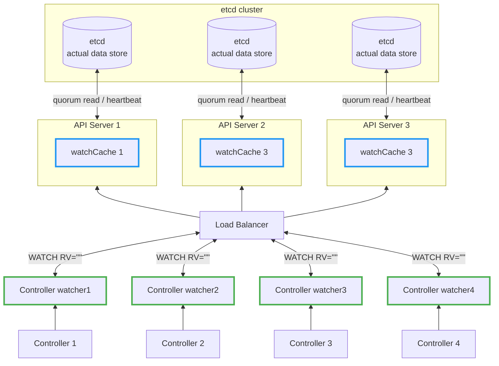

## Why KEP-3157
In large clusters, the LIST+WATCH patterns would cause 2 problems:
1. **Memory Explosion**: Full LIST requests load all resources into memory at once. With thousands of resources, this causes gigabytes of memory consumption per request, risking API server crashes.

2. **Stale Reads**: Traditional LIST uses RV="0", which reads from watchCache without consistency guarantees, potentially serving stale data.

KEP 3157 addresses these issues by introducing a streaming-based approach that:
- Ensures controllers receive consitent, up-to-date data by RV="", avoid reading **stale data**
- Replace memory-intensive LIST+WATCH pattern with single streaming WATCH request


## HA with Stacked etcd topology
KEP-3157 focuses on:

- Memory Efficiency in watchCache
- **Consistency Guarantee** between watchCache across the cluster
- Prevent controller watcher read the stale data.



## ResourceVersion Semantics


| Semantics | `RV=""` | `RV="0"` |
|------|---------|----------|
| Source | etcd quorum read | Watch Cache |
| Latency | High | Low |
| Data Fresh | latest | Can be stale |
| Consistency | Strong Consistency | Eventual concistwency |
| Use case | Initializartion the wattchCache | Monitoring |

### `RV=""`
- FLow: etcd **Quorum Read**
- Why CP
  - Performs quorum read from etcd to ensure strong consistency, but may block during network partitions.


### `RV="0"`
- Flow: Read **Watch Cache**, if empty fall back to etcd **Quorum Read**
- Why AP
  - Serves from apiserver's watch cache for immediate response and high availability, tolerating eventual consistency.

## Consistency Guarantee Mechanism
RV in the watchCache could be different from the one in controller watch cache (CW), due to the wirting speed of each api-server.

If Controller 2 call the RV = "0", it will get the data with RV = 95, which is the root cause of [stale read](https://github.com/kubernetes/kubernetes/issues/59848).
```bash
etcd cluster
    ↓
    ├─→ API Server 1 → watchCache 1 (RV=100) → Controller 1
    ├─→ API Server 2 → watchCache 2 (RV=95)  → Controller 2
    └─→ API Server 3 → watchCache 3 (RV=100) → Controller 3
```

### KEP-3157 Solution
To avoid this, the when the controller watch has new watch connectopn provide new flag RV=""（通常伴隨 sendInitialEvents=true, ensure the qurom read fro mthe data.

now the problem becomes the interesting, watchCache RV may different from the cntroller watch RV
 in beta
更複雜的策略：
- 預先檢查 RV 差距
- 如果 bookmark 在 buffer 裡，優雅關閉
- 如果不在，hard-close 連線
if cntroller watch RV - watchCache RV >= 1000, buffer size of the cntroller watch cache, whjich may be timeout, 但希望他不會差太多導致 sync 不完成

如果差太多 timeout 會到，會讓CW連另外一個 api server -> 此時因為 perform queorm read =-> ensure the data upto date-> 秘密o f Consistency Guarantee Mechanism

如何判斷同步完成：靠 [bookmark](#bookmark-note) 事件

詳情請見 kep

### Why does the stream can alleviate the memeory
Watch list use stream apporach to keep only one cache in the local, and use RV="" initilaization to ensure the read is not out of date, even the controller is switch to another api-server which also guanrantee

each watcher only stream from the latest watch cache rv, which save sometime.

## Take away
1. watch list use RV="" initilazation to ensure the read is not stale
2. even the controller watcher is timeout after the sync, but the next connection is still read the upto date date data until it fail
3. For high-QPS, freshness-tolerant reads, RV="0" serves from the watch cache with low latency.
4. KEP-3157 provide resourceVersionMatch=NotOlderThan to prevent reading “older than what you already saw” when the LB switches API servers.


## Problem
For every watcher to read the data from informer, it require to List the data first, then watch the event changes, which brought
	- If there are many watcher, it will operate the same things.
	- Each List will do the following
        1. LIST RV="0" request
           - Require the entire etcd read, which will cause the high mem usage for loading the data
           - The moment where data read it will has the issue, may not consist
        2. WATCH the resource
        3. When the data is either expired or compact, will start from #1


## Solution
Watch list


### How to get the alert for the apiserver?
### step2.
- upon receiving the request from an informer, contact etcd to get the latest RV. It will be used to make sure the watch cache has seen objects up to the received RV. This step is necessary and ensures we will serve consistent data, even from the cache.
- why can we ensure it upto date?
- cold start of etcd?

### How does sample apiserver works on watch list implementation?

### bookmark event
### list RV = 0


### Env
### Code to test it
### Code to test it
<a id="bookmark-ref"></a>
- … [bookmark](#bookmark-note)

<a id="rv-empty-ref"></a>
- … [RV=""](#rv-empty-note)

<a id="rv-0-ref"></a>
- … [RV=0](#rv-0-note)


### trade off using the RV=0 with CAP
# ResourceVersion 參數對比

## 核心差異


## KEP 3157 的改進

新的 Watch-List 方法結合兩者優勢：

```
1. 使用 RV="" 建立一致性基準點
2. 等待 Watch Cache 同步到該基準點
3. 從 Watch Cache 進行高效串流傳輸
```

這種方式既保證了一致性，又避免了記憶體爆炸問題。

## How does it affect to the watcher?
overall flow it
controller -> informer -> [reflector](#relector-note) -> API server -> etcd

## Experiment

---
#### Reference
- [KEP-3157](https://github.com/kubernetes/enhancements/blob/master/keps/sig-api-machinery/3157-watch-list/README.md)

#### Note
- <a id="bookmark-note"></a> **Bookmark Event** — a Kubernetes watch event that notifies the client of the query object's resource version.